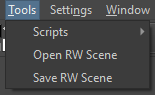

### RW Scene Editor

A Krita plugin for loading and saving Rain World scenes. This plugin adds two actions under `Tools` for opening and saving scenes.

## How does it work
Scenes are opened as a new file with the images and depth-maps as separate layers on top of eachother and at the correct offset. To open a scene, select "Open RW Scene" then navigate to its `positions.txt` file and open it.

To save a scene, select "Save RW Scene" the folder where that scene will be saved. The scene files will be exported inside the selected folder, with no subfolder.

## Important notes

- Offsets are calculated considering a 1366x768 viewport centered in the 1920x1080 file, so there's a reasonable margin all around the image.

- Scenes from the game can be imported automatically, but for new scenes, a `layers.txt` file is REQUIRED. This file must have the name of the layers, separated by newlines, in the order they need to be loaded (bottomost first).

- Adding more layers, reordering layers, changing their parallax depth etc is likely to require some extra work in the code side of things to load these changes back into the game. Keep that in mind.

- Once loaded, a scene is composed of several `name[img]` and `name[dpt]` layers. In order to add new layers, this naming convention must be followed. You can use groups that follow this nomenclature if you want to work with more layers to be exported as a single one.

## Instalation

Download the zip from [the releases page](https://github.com/henpemaz/RWSceneEditor/releases/latest) (not the source code, the zip!)

Tools -> Scripts -> Import from file -> Select the downloaded .zip -> Yes -> Close Krita (and then re-open it)

When in doubt, check the [manual](https://docs.krita.org/en/user_manual/python_scripting/install_custom_python_plugin.html)